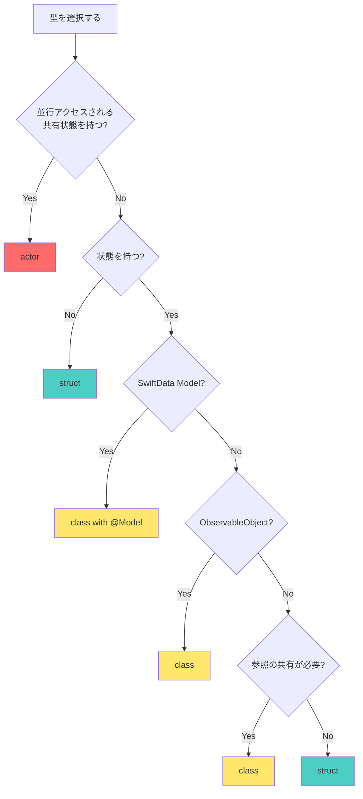

# Swift型の使い分けガイド: class / struct / actor

このドキュメントでは、Swiftにおける `class`、`struct`、`actor` の使い分けについて、プロジェクト内の実例を交えて説明します。

## 📋 概要

| 型 | 値型/参照型 | 継承 | 並行性 | 主な用途 |
|---|---|---|---|---|
| **struct** | 値型 | ❌ | ❌ | 不変データ、値オブジェクト、SwiftUI View |
| **class** | 参照型 | ✅ | ❌ | 状態を持つオブジェクト、SwiftData Model、ViewModel |
| **actor** | 参照型 | ❌ | ✅ | 並行アクセスされる状態の管理 |

## 🏗 struct（構造体）

### 特徴

- **値型**: コピーされる（Copy-on-Write最適化あり）
- **不変性**: デフォルトで不変、変更には `mutating` が必要
- **スレッドセーフ**: コピーされるため、並行アクセスの問題が起きにくい
- **継承不可**: プロトコル準拠は可能

### 使用すべき場面

1. **データモデル（値オブジェクト）**
2. **SwiftUI View**
3. **UseCase（ビジネスロジック）**
4. **ステートレスなサービス**
5. **小さなデータ構造**

### プロジェクト内の実例

#### 1. UseCase（ビジネスロジック）

```swift
// MyBestAITasksCore/Domain/CreateGoalUseCase.swift
public struct CreateGoalUseCase {
    @Dependency(\.geminiClient) var geminiClient
    @Dependency(\.logger) var logger
    
    public init() {}
    
    public func execute(title: String, deadline: Date, apiKey: String) async throws -> Goal {
        // ビジネスロジックの実装
    }
}
```

**理由**:
- ステートレス（状態を持たない）
- 依存関係は `@Dependency` で注入
- 値型のため、並行実行時の副作用がない
- テストが容易（インスタンス生成が軽量）

#### 2. SwiftUI View

```swift
// Feature/GoalList/GoalListView.swift
struct GoalListView: View {
    @StateObject private var viewModel: GoalListViewModel
    
    var body: some View {
        // UI定義
    }
}
```

**理由**:
- SwiftUIの要件（`View` プロトコルは `struct` を想定）
- 値型のため、SwiftUIの差分検出が効率的
- 不変性により、予期しない状態変更を防ぐ

#### 3. デザイントークン

```swift
// DesignSystem/DesignSystem.swift
public struct DesignSystem {
    public struct Colors {
        public static let primaryOrange = Color("PrimaryOrange", bundle: .module)
        public static let secondaryRed = Color("SecondaryRed", bundle: .module)
    }
    
    public struct Spacing {
        public static let small: CGFloat = 8
        public static let medium: CGFloat = 16
    }
}
```

**理由**:
- 定数の集合（状態を持たない）
- 名前空間として機能
- 値型で十分

#### 4. ステートレスなクライアント

```swift
// MyBestAITasksCore/Data/DataSources/GeminiService.swift
public struct GeminiClient {
    public func generateTasks(goal: String, deadline: Date, apiKey: String) async throws -> [GoalTask] {
        // API呼び出し
    }
}
```

**理由**:
- ステートレス（APIキーは引数で受け取る）
- `Sendable` 準拠が容易（並行処理で安全）
- 依存性注入との相性が良い

#### 5. 小さなデータ構造

```swift
// MyBestAITasksCore/Infrastructure/Logger/LoggerClient.swift
public struct LoggerClient: Sendable {
    public func log(_ message: String, level: LogLevel = .info) {
        print("[\(level)] \(message)")
    }
}
```

**理由**:
- 単純なロギング機能
- 状態を持たない
- `Sendable` 準拠が必要

## 🎓 class（クラス）

### 特徴

- **参照型**: 参照が共有される
- **可変性**: プロパティを自由に変更可能
- **継承可能**: サブクラスを作成できる
- **デイニシャライザ**: `deinit` でクリーンアップ可能

### 使用すべき場面

1. **状態を持つオブジェクト**
2. **SwiftData Model（`@Model` マクロの要件）**
3. **ViewModel（`ObservableObject`）**
4. **参照の共有が必要な場合**
5. **継承が必要な場合**

### プロジェクト内の実例

#### 1. SwiftData Model

```swift
// MyBestAITasksCore/Model/Goal.swift
@Model
public final class Goal {
    public var id: UUID
    public var title: String
    public var deadline: Date
    @Relationship(deleteRule: .cascade, inverse: \GoalTask.goal)
    public var tasks: [GoalTask]
    @Relationship(deleteRule: .cascade, inverse: \Milestone.goal)
    public var milestones: [Milestone]
    
    public init(id: UUID = UUID(), title: String, deadline: Date, ...) {
        // 初期化
    }
}
```

**理由**:
- **SwiftDataの要件**: `@Model` マクロは `class` にのみ適用可能
- **参照型が必要**: リレーションシップは参照で管理される
- **可変性**: データベースの状態を反映するため、プロパティの変更が必要
- **`final`**: 継承を防ぐ（意図しないサブクラス化を避ける）

#### 2. ViewModel

```swift
// Feature/GoalList/GoalListViewModel.swift
class GoalListViewModel: ObservableObject {
    @Published var goals: [Goal] = []
    @Published var isLoading = false
    @Published var errorMessage: String?
    
    @Dependency(\.goalRepository) var repository
    
    func loadGoals() async {
        // データ読み込み
    }
}
```

**理由**:
- **`ObservableObject` の要件**: `class` である必要がある
- **状態管理**: `@Published` プロパティで状態を保持
- **参照の共有**: Viewから参照され、状態変更がViewに反映される
- **ライフサイクル管理**: `deinit` でリソースのクリーンアップが可能

#### 3. Repository（状態を持つデータアクセス層）

```swift
// MyBestAITasksCore/Data/Repositories/GoalRepository.swift
public class GoalRepository: GoalRepositoryProtocol {
    private let modelContext: ModelContext
    private let goalsSubject = CurrentValueSubject<[Goal], Never>([])
    
    public init(modelContext: ModelContext) {
        self.modelContext = modelContext
        loadData()
    }
    
    public func getGoals() -> AnyPublisher<[Goal], Never> {
        return goalsSubject.eraseToAnyPublisher()
    }
}
```

**理由**:
- **状態を保持**: `modelContext` と `goalsSubject` を保持
- **参照の共有**: 複数の場所から同じRepositoryインスタンスを参照
- **Combineとの統合**: `CurrentValueSubject` は参照型

#### 4. インフラストラクチャサービス（状態を持つ）

```swift
// MyBestAITasksCore/Infrastructure/Notification/NotificationManager.swift
public class NotificationManager: NotificationManaging {
    private let center = UNUserNotificationCenter.current()
    
    public init() {}
    
    public func requestAuthorization() async throws -> Bool {
        // 権限リクエスト
    }
}
```

**理由**:
- **状態を保持**: `UNUserNotificationCenter` インスタンスを保持
- **シングルトン的な使用**: アプリ全体で1つのインスタンスを共有

#### 5. Keychainヘルパー

```swift
// MyBestAITasksCore/Infrastructure/Security/KeychainHelper.swift
public class KeychainHelper {
    public init() {}
    
    public func save(_ value: String, forKey key: String) throws {
        // Keychainへの保存
    }
    
    public func retrieve(forKey key: String) throws -> String? {
        // Keychainからの取得
    }
}
```

**理由**:
- **参照型が適切**: Keychainアクセスは副作用を伴う
- **状態は持たないが、参照型**: 将来的にキャッシュなどの状態を追加する可能性

### `final` キーワードの使用

プロジェクトでは、継承を意図しない `class` には `final` を付けています。

```swift
public final class Goal { ... }
public final class GoalTask { ... }
public final class Milestone { ... }
```

**理由**:
- **パフォーマンス**: メソッドディスパッチが静的になり、高速化
- **意図の明確化**: 継承を許可しないことを明示
- **安全性**: 意図しないサブクラス化を防ぐ

## ⚡️ actor（アクター）

### 特徴

- **参照型**: 参照が共有される
- **並行性安全**: データ競合を自動的に防ぐ
- **分離された状態**: 外部から直接アクセスできない（`await` が必要）
- **継承不可**: プロトコル準拠は可能

### 使用すべき場面

1. **並行アクセスされる共有状態**
2. **データ競合を防ぎたい場合**
3. **非同期処理で状態を管理する場合**

### プロジェクト内の実例

#### カレンダーアクセス状態の管理

```swift
// MyBestAITasksCore/Data/DataSources/CalendarActor.swift
actor CalendarActor {
    let eventStore = EKEventStore()
    var isAccessGranted: Bool = false
    
    func setAccessGranted(_ granted: Bool) {
        self.isAccessGranted = granted
    }
}
```

**理由**:
- **並行アクセスの安全性**: 複数の非同期タスクから同時にアクセスされる可能性
- **状態の保護**: `isAccessGranted` の変更が安全に行われる
- **EventKitとの統合**: `EKEventStore` は並行アクセスに注意が必要

#### 使用例

```swift
// MyBestAITasksCore/Data/DataSources/CalendarService.swift
public struct CalendarClient: Sendable {
    public func requestAccess() async throws -> Bool {
        let actor = CalendarActor()
        
        do {
            let granted = try await actor.eventStore.requestFullAccessToEvents()
            await actor.setAccessGranted(granted)
            return granted
        } catch {
            throw CalendarError.accessDenied
        }
    }
}
```

**ポイント**:
- `await` を使用してアクターのメソッドを呼び出す
- データ競合が自動的に防がれる

## 🤔 判断フローチャート



## 📊 プロジェクト内の使用統計

### struct の使用例

- **UseCase**: `CreateGoalUseCase`, `ToggleTaskStatusUseCase`
- **View**: すべてのSwiftUI View（`GoalListView`, `GoalDetailView` など）
- **Client**: `GeminiClient`, `CalendarClient`, `LoggerClient`
- **デザイントークン**: `DesignSystem.Colors`, `DesignSystem.Spacing`
- **UIコンポーネント**: `DSButton`, `DSCard`, `DSTextField`

### class の使用例

- **Model**: `Goal`, `GoalTask`, `Milestone`（SwiftDataの要件）
- **ViewModel**: `GoalListViewModel`, `GoalDetailViewModel`, `GoalInputViewModel`
- **Repository**: `GoalRepository`, `MockGoalRepository`
- **Infrastructure**: `NotificationManager`, `KeychainHelper`

### actor の使用例

- **CalendarActor**: カレンダーアクセス状態の並行管理

## ✅ ベストプラクティス

### 1. デフォルトは `struct` を選ぶ

理由:
- 値型は安全（コピーされるため副作用が少ない）
- スレッドセーフ
- パフォーマンスが良い（Copy-on-Write最適化）

### 2. 状態を持つ場合は `class` を検討

理由:
- 参照の共有が必要
- `ObservableObject` や `@Model` の要件
- ライフサイクル管理が必要

### 3. 並行アクセスされる状態は `actor` を使う

理由:
- データ競合を自動的に防ぐ
- 明示的な `await` により、非同期アクセスが明確

### 4. `final` を積極的に使う

理由:
- 継承を意図しない場合は `final` を付ける
- パフォーマンス向上
- 意図の明確化

### 5. `Sendable` を意識する

理由:
- 並行処理で安全に使用できる型には `Sendable` を付ける
- `struct` は自動的に `Sendable` になることが多い
- `class` や `actor` は明示的に準拠が必要な場合がある

## 🔒 シングルトンインスタンスの扱い

### シングルトンパターンとは

シングルトンパターンは、クラスのインスタンスがアプリケーション全体で1つだけ存在することを保証するデザインパターンです。

### 従来のシングルトン実装（非推奨）

```swift
// ❌ 避けるべき古いパターン
class OldStyleManager {
    static let shared = OldStyleManager()
    
    private init() {}  // 外部からのインスタンス化を防ぐ
    
    func doSomething() {
        // 処理
    }
}

// 使用例
OldStyleManager.shared.doSomething()
```

### なぜシングルトンを避けるべきか

1. **テストが困難**: グローバル状態のため、テスト間で状態が共有される
2. **依存関係が不明確**: どこからでもアクセスできるため、依存関係が隠蔽される
3. **並行処理の問題**: 状態を持つ場合、データ競合のリスクがある
4. **疎結合の阻害**: 具象クラスへの直接依存が発生する

### モダンなSwiftでの代替手段: 依存性注入

このプロジェクトでは、**Point-Free社の `swift-dependencies` ライブラリ**を使用して、シングルトンを避けています。

#### 1. クライアントの定義（`struct` を使用）

```swift
// MyBestAITasksCore/Infrastructure/Logger/LoggerClient.swift
public struct LoggerClient: Sendable {
    public var log: @Sendable (String, LogLevel) -> Void
    
    public func log(_ message: String, level: LogLevel = .info) {
        log(message, level)
    }
}
```

#### 2. 依存性の登録

```swift
// Dependencies拡張で登録
extension DependencyValues {
    var logger: LoggerClient {
        get { self[LoggerClient.self] }
        set { self[LoggerClient.self] = newValue }
    }
}

extension LoggerClient: DependencyKey {
    public static let liveValue = LoggerClient { message, level in
        print("[\(level)] \(message)")
    }
    
    public static let testValue = LoggerClient { message, level in
        // テスト用の実装（何もしない、またはモック）
    }
}
```

#### 3. 使用側での注入

```swift
// MyBestAITasksCore/Domain/CreateGoalUseCase.swift
public struct CreateGoalUseCase {
    @Dependency(\.logger) var logger  // 自動的に注入される
    @Dependency(\.geminiClient) var geminiClient
    
    public func execute(title: String, deadline: Date, apiKey: String) async throws -> Goal {
        logger.log("Creating goal: \(title)")
        // ビジネスロジック
    }
}
```

### プロジェクト内での実践例

#### 例1: GeminiClient（APIクライアント）

```swift
// シングルトンではなく、structで定義
public struct GeminiClient {
    public func generateTasks(goal: String, deadline: Date, apiKey: String) async throws -> [GoalTask] {
        // API呼び出し
    }
}

// 依存性として登録
extension DependencyValues {
    var geminiClient: GeminiClient {
        get { self[GeminiClient.self] }
        set { self[GeminiClient.self] = newValue }
    }
}

// 使用例
@Dependency(\.geminiClient) var geminiClient
let tasks = try await geminiClient.generateTasks(...)
```

**利点**:
- テスト時にモックに差し替え可能
- 依存関係が明示的
- `Sendable` 準拠が容易

#### 例2: CalendarClient（システムサービスのラッパー）

```swift
// シングルトンではなく、structで定義
public struct CalendarClient: Sendable {
    public func requestAccess() async throws -> Bool {
        let actor = CalendarActor()  // 内部でactorを使用
        // カレンダーアクセス処理
    }
}

// 依存性として登録
extension DependencyValues {
    var calendarClient: CalendarClient {
        get { self[CalendarClient.self] }
        set { self[CalendarClient.self] = newValue }
    }
}
```

**利点**:
- システムAPIへのアクセスを抽象化
- テスト時にモックカレンダーを使用可能
- 並行処理の安全性（内部でactorを使用）

#### 例3: Repository（データアクセス層）

```swift
// Repositoryはclassだが、シングルトンではない
public class GoalRepository: GoalRepositoryProtocol {
    private let modelContext: ModelContext
    
    public init(modelContext: ModelContext) {
        self.modelContext = modelContext
    }
}

// 依存性として登録
extension DependencyValues {
    var goalRepository: GoalRepositoryProtocol {
        get { self[GoalRepositoryKey.self] }
        set { self[GoalRepositoryKey.self] = newValue }
    }
}

private enum GoalRepositoryKey: DependencyKey {
    static let liveValue: GoalRepositoryProtocol = GoalRepository(modelContext: ...)
    static let testValue: GoalRepositoryProtocol = MockGoalRepository()
}
```

**利点**:
- プロトコルベースで抽象化
- テスト時に `MockGoalRepository` に差し替え可能
- 依存関係が明示的

### シングルトンが許容される例外的なケース

以下の場合は、システムが提供するシングルトンを使用することが一般的です：

```swift
// ✅ システム提供のシングルトン（許容される）
let userDefaults = UserDefaults.standard
let notificationCenter = NotificationCenter.default
let fileManager = FileManager.default
let urlSession = URLSession.shared
```

ただし、これらも依存性注入でラップすることで、テスタビリティを向上できます：

```swift
// より良いアプローチ
public struct UserDefaultsClient {
    public var save: @Sendable (String, String) -> Void
    public var load: @Sendable (String) -> String?
}

extension UserDefaultsClient: DependencyKey {
    public static let liveValue = UserDefaultsClient(
        save: { value, key in
            UserDefaults.standard.set(value, forKey: key)
        },
        load: { key in
            UserDefaults.standard.string(forKey: key)
        }
    )
    
    public static let testValue = UserDefaultsClient(
        save: { _, _ in },
        load: { _ in nil }
    )
}
```

### シングルトン vs 依存性注入の比較

| 観点 | シングルトン | 依存性注入 |
|---|---|---|
| **テスト容易性** | ❌ 困難（グローバル状態） | ✅ 容易（モックに差し替え可能） |
| **依存関係の明示性** | ❌ 不明確（隠蔽される） | ✅ 明確（`@Dependency` で宣言） |
| **並行処理の安全性** | ❌ 手動で管理が必要 | ✅ `Sendable` や `actor` で保証 |
| **疎結合性** | ❌ 具象クラスに依存 | ✅ プロトコルに依存可能 |
| **コード量** | ✅ 少ない | ⚠️ やや多い（登録が必要） |

### ベストプラクティス

1. **シングルトンは避ける**: 新しいコードでは `static let shared` パターンを使わない
2. **依存性注入を使う**: `@Dependency` マクロで依存関係を注入
3. **プロトコルで抽象化**: テスト時にモックに差し替えられるようにする
4. **`struct` を優先**: ステートレスなクライアントは `struct` で定義
5. **`actor` で並行性を管理**: 状態を持つ場合は `actor` を検討

### まとめ

- **従来のシングルトン**: `static let shared` パターンは避ける
- **モダンなアプローチ**: 依存性注入（`swift-dependencies`）を使用
- **プロジェクトの方針**: すべてのサービスは依存性注入で管理
- **例外**: システム提供のシングルトンは使用可能だが、ラップすることを推奨

## 🚫 アンチパターン

### ❌ 状態を持たないのに `class` を使う

```swift
// 悪い例
class MathHelper {
    func add(_ a: Int, _ b: Int) -> Int {
        return a + b
    }
}

// 良い例
struct MathHelper {
    func add(_ a: Int, _ b: Int) -> Int {
        return a + b
    }
}
```

### ❌ 並行アクセスされる状態を `class` で管理

```swift
// 悪い例（データ競合の可能性）
class Counter {
    var count = 0
    
    func increment() {
        count += 1  // 並行アクセスで競合の可能性
    }
}

// 良い例
actor Counter {
    var count = 0
    
    func increment() {
        count += 1  // 安全
    }
}
```

### ❌ SwiftUI Viewを `class` で定義

```swift
// 悪い例（コンパイルエラー）
class MyView: View {  // Error: 'View' requires 'Self' to be a struct
    var body: some View {
        Text("Hello")
    }
}

// 良い例
struct MyView: View {
    var body: some View {
        Text("Hello")
    }
}
```

## 📚 参考資料

- [Swift Language Guide - Structures and Classes](https://docs.swift.org/swift-book/LanguageGuide/ClassesAndStructures.html)
- [Swift Language Guide - Concurrency](https://docs.swift.org/swift-book/LanguageGuide/Concurrency.html)
- [WWDC 2021 - Protect mutable state with Swift actors](https://developer.apple.com/videos/play/wwdc2021/10133/)
- [SwiftData Documentation](https://developer.apple.com/documentation/swiftdata)

## 🎯 まとめ

| 型 | 使用場面 | プロジェクト内の例 |
|---|---|---|
| **struct** | ステートレス、値オブジェクト、View | UseCase, SwiftUI View, Client |
| **class** | 状態を持つ、SwiftData Model, ViewModel | Goal, GoalRepository, ViewModel |
| **actor** | 並行アクセスされる共有状態 | CalendarActor |

**基本方針**:
1. まず `struct` を検討
2. 状態が必要なら `class`
3. 並行アクセスがあるなら `actor`
